# Wireless Polygraph — Flowchart ทั้งระบบ

ไฟล์นี้อธิบายการทำงานของระบบเป็นภาพ (Mermaid) เปิดดูได้ใน VS Code (Markdown Preview) หรือ GitHub
แต่ละภาพบอกด้วยว่าเป็นโค้ดไฟล์ไหน เผื่ออาจารย์ถามว่า "ส่วนนี้อยู่ตรงไหนในโค้ด"

สารบัญ

1. ภาพรวมระบบ (ฮาร์ดแวร์ → เฟิร์มแวร์ → หน้าเว็บ/คอม)
2. ลำดับการบูต `setup()`
3. FreeRTOS task และการส่งข้อมูลระหว่าง task
4. เส้นทางสัญญาณ: เซนเซอร์ → DSP → LieEngine
5. State machine ของ LieEngine
6. การตัดสิน 1 ข้อ (จริง / โกหก)
7. การเก็บข้อมูลเทรน AI (fix / manual)
8. Pipeline ของ AI: เก็บข้อมูล → เทรน → ใช้งานบนนาฬิกา
9. Polygraph Studio: backend / frontend
10. Watchdog 3 ชั้น + กล่องดำ
11. พลังงานและ sleep
12. แผนที่หน่วยความจำ (Flash map) และที่เก็บข้อมูลแต่ละชนิด
13. OTA + rollback
14. Serial console (คำสั่งพิมพ์)

---

## 1. ภาพรวมระบบ

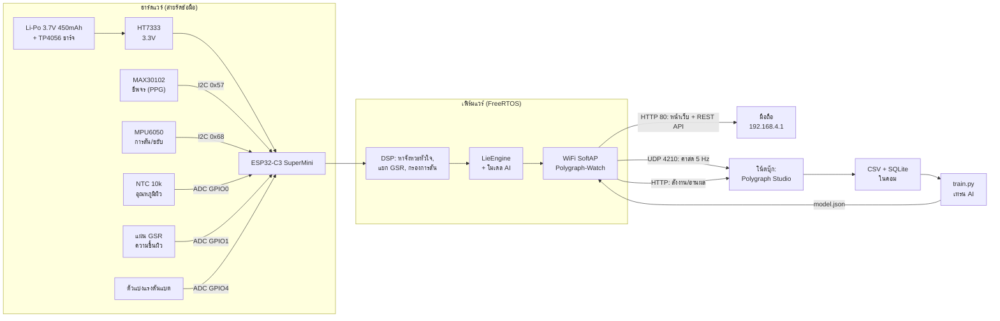

---

## 2. ลำดับการบูต `setup()` — `src/main.cpp`

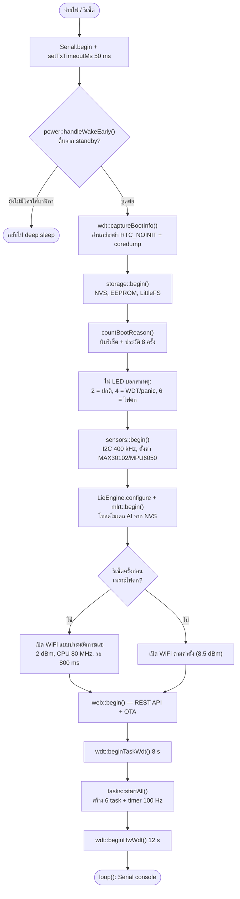

---

## 3. FreeRTOS task และการส่งข้อมูล — `src/tasks.cpp`, `src/app.h`

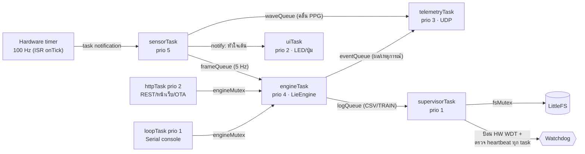

ทำไมแบ่งแบบนี้: งานที่ต้องตรงเวลา (สุ่มสัญญาณ 100 Hz) ได้ priority สูงสุด ส่วนงานช้า เช่น เขียนแฟลช ส่งไปทำใน task priority ต่ำผ่านคิว
งานใน ISR สั้นที่สุด คือแค่ "ปลุก" sensorTask (deferred interrupt processing)

---

## 4. เส้นทางสัญญาณ — `src/sensors.cpp`, `src/dsp/*`

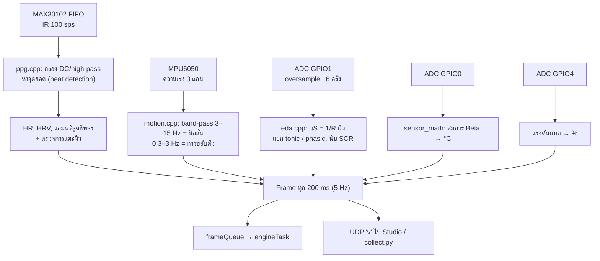

---

## 5. State machine ของ LieEngine — `src/lie/lie_engine.cpp`

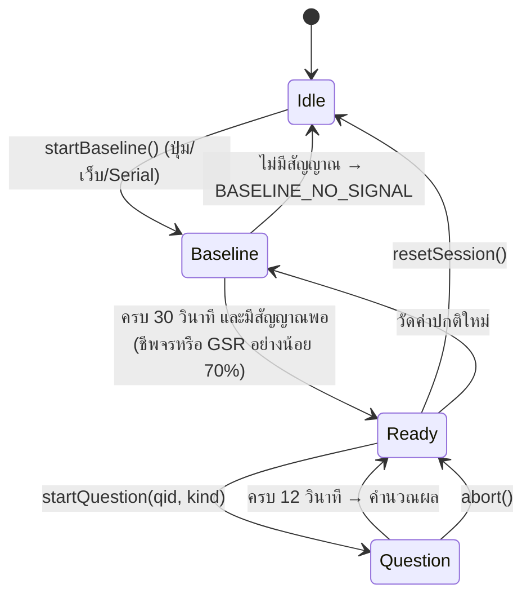

---

## 6. การตัดสิน 1 ข้อ

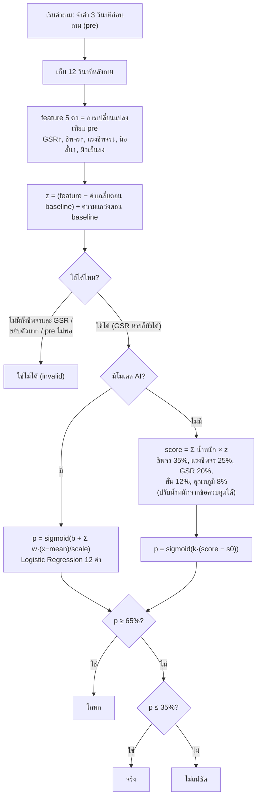

---

## 7. การเก็บข้อมูล / ใช้งานจริง — `Polygraph-Studio/ml/recorder.py`, `backend/collector.py`, `ml/collect.py`

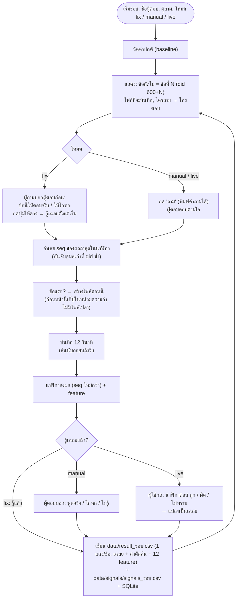

---

## 8. Pipeline ของ AI

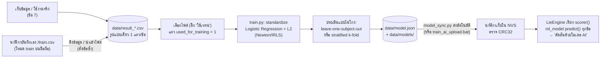

---

## 9. Polygraph Studio — `Polygraph-Studio/backend`, `frontend`

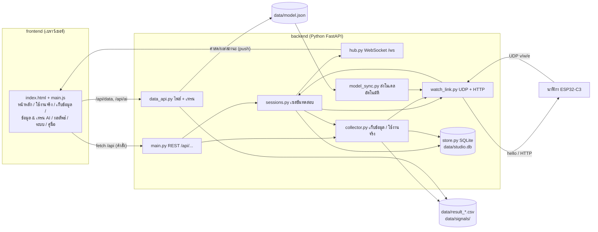

---

## 10. Watchdog 3 ชั้น + กล่องดำ — `src/sys/watchdog.cpp`

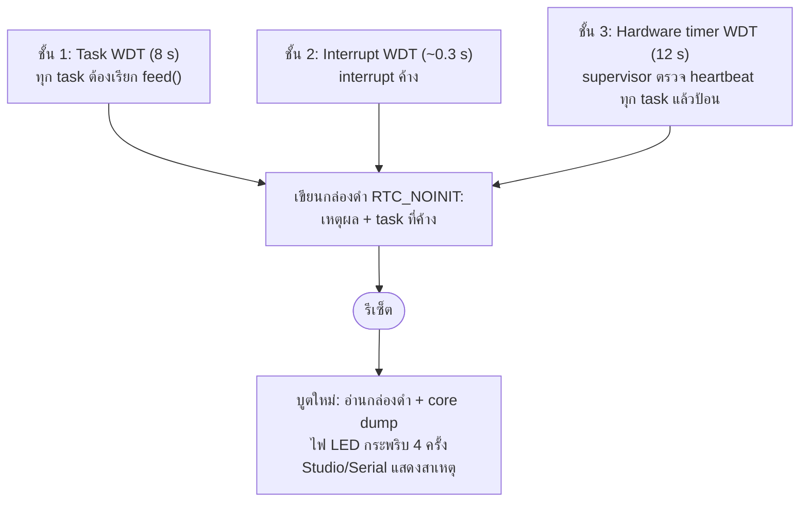

สาธิตได้จริง: Serial `wdt twdt confirm` / หน้า "ระบบ & อุปกรณ์" ปุ่มสาธิต watchdog

---

## 11. พลังงานและ sleep — `src/sys/power.cpp`

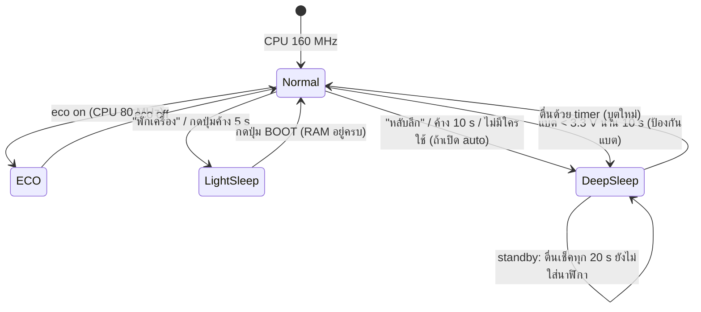

ค่าเริ่มต้น: หลับอัตโนมัติ = ปิด, ไม่หลับเองขณะเสียบ USB

---

## 12. แผนที่หน่วยความจำ (Flash 4 MB) และที่เก็บข้อมูล — `partitions_polygraph.csv`, `src/sys/storage.h`

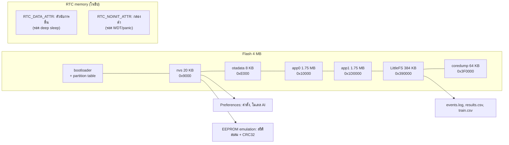

---

## 13. OTA + rollback — `src/sys/ota.cpp`

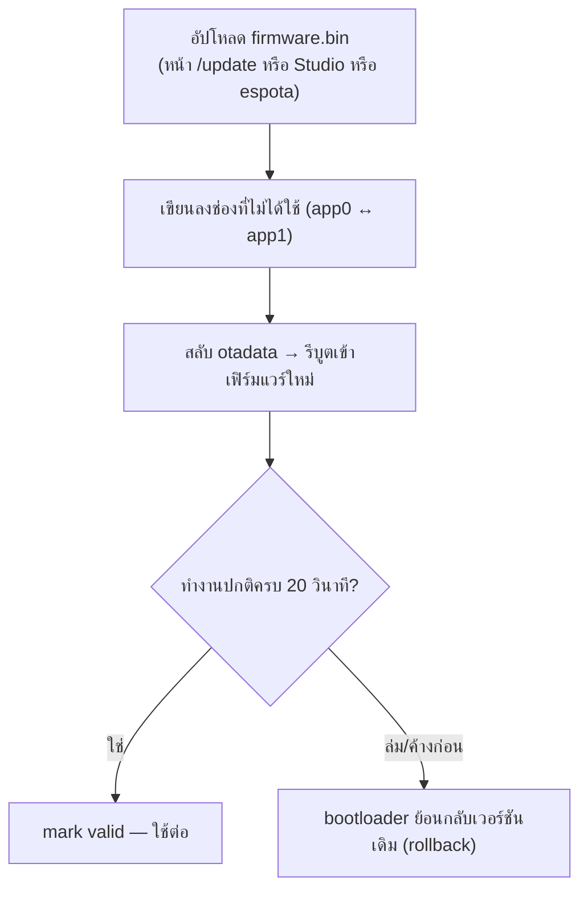

---

## 14. Serial console — `src/cli.cpp`

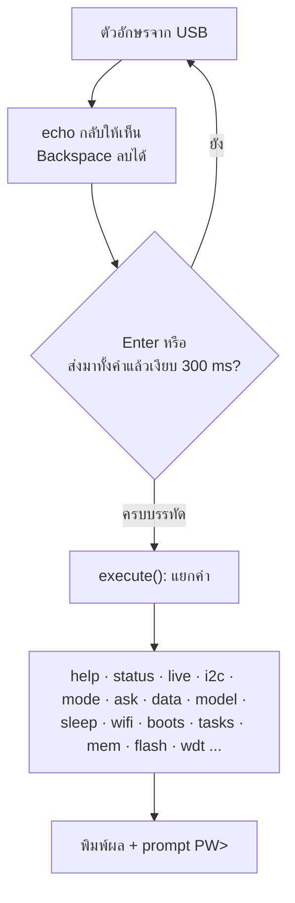
