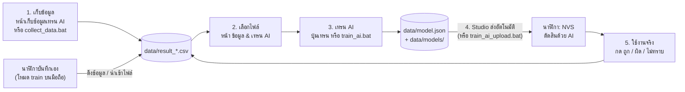

# คู่มือเทรน AI — Wireless Polygraph (Studio 2.3)

เอกสารนี้ตอบ 4 คำถามที่สับสนบ่อยที่สุดก่อน แล้วค่อยลงขั้นตอนละเอียดทีละคลิก
(ความหมายของทุกคอลัมน์: `Polygraph-Studio/DATA_DICTIONARY.md` · แผนที่ไฟล์ทั้งโปรเจกต์: `PROJECT_MAP.md`)

---

## ตอบสั้น ๆ ก่อน

### 1) เทรนจากไฟล์ไหน

**ไฟล์ `Polygraph-Studio/data/result_<YYYYMMDD_HHMMSS>.csv` เท่านั้น** (เช่น `result_20261008_164801.csv`)

- อ่านเฉพาะไฟล์ที่อยู่ในโฟลเดอร์ `data/` โดยตรง ไม่อ่านโฟลเดอร์ย่อย (`signals/`, `old_format/`, `models/`)
- ไม่อ่านไฟล์ที่ติ๊ก "ใช้เทรน" ออก (รายชื่ออยู่ใน `data/train_exclude.txt`)
- ในแต่ละไฟล์ ใช้เฉพาะแถวที่ `used_for_training = 1` และ `label` เป็น `truth` หรือ `lie`
- ทั้งปุ่ม "เทรน AI" ใน Studio และ `train_ai.bat` ใช้กติกาเดียวกัน (โค้ดตัวเดียวกัน `ml/train.py`)

### 2) ไฟล์ CSV แต่ละแบบได้มาจากไหน ชื่ออะไร

| ทำอะไร | ได้ไฟล์ชื่อ | อยู่ที่ไหน | ต้องทำอะไรต่อ |
|---|---|---|---|
| เก็บข้อมูลในหน้า "เก็บข้อมูลเทรน AI" / `collect_data.bat` | `result_<วันเวลาเริ่มรอบ>.csv` | `data/` (บันทึกเองอัตโนมัติ) | ไม่ต้องทำอะไร พร้อมเทรน |
| ใช้หน้า "ใช้งานจริง" แล้วกด ถูก/ผิด | `result_<วันเวลาเริ่มรอบ>.csv` | `data/` (อัตโนมัติ) | ไม่ต้องทำอะไร ข้อที่รู้คำตอบเทรนได้ |
| กด "ดาวน์โหลดไฟล์นี้" ในตารางประวัติ | `result_<วันเวลา>.csv` (สำเนา) | โฟลเดอร์ Downloads | ไม่ต้องทำอะไร (ต้นฉบับอยู่ใน data/ แล้ว) |
| กด "รวมทุกไฟล์เป็นไฟล์เดียว" | `result_all_<เวลาที่กด>.csv` | โฟลเดอร์ Downloads | ไว้เปิดดู/ส่งเพื่อน — **อย่าย้ายเข้า data/** (ข้อเดิมจะซ้ำ) |
| กด "ดาวน์โหลด CSV" บนหน้าเว็บในนาฬิกา (มือถือ) | `polygraph_train.csv` | โฟลเดอร์ Downloads | Studio > ข้อมูล & เทรน AI > **นำเข้าไฟล์ CSV** → กลายเป็น `result_*.csv` |
| กด "ดึงข้อมูลที่นาฬิกาบันทึกเอง" ใน Studio | `result_<เวลาที่กด>.csv` | `data/` | ไม่ต้องทำอะไร (เพิ่มเฉพาะข้อที่ยังไม่มี) |
| `signals_<รอบ>.csv` | ค่าเซนเซอร์ 5 ครั้ง/วินาที | `data/signals/` | ไว้ดูกราฟ — **ไม่ได้ใช้เทรน** |

### 3) `train_ai.bat` กับ `train_ai_upload.bat` ต่างกันยังไง

| | `train_ai.bat` | `train_ai_upload.bat` |
|---|---|---|
| ทำอะไร | **เทรน** จาก `data/result_*.csv` → บันทึก `data/model.json` → ถ้าคอมต่อ WiFi นาฬิกาอยู่ ส่งเข้านาฬิกาให้เลย | **ส่งอย่างเดียว** — เอา `data/model.json` ที่มีอยู่ส่งเข้านาฬิกา ไม่เทรนใหม่ |
| ใช้เมื่อไร | หลังเก็บข้อมูลเพิ่ม (ถ้าไม่อยากเปิด Studio) | เทรนตอนคอมไม่ได้ต่อ WiFi นาฬิกา แล้วไม่อยากเปิด Studio |
| ต้องต่อ WiFi นาฬิกาไหม | ไม่ต้อง (ต่อ = ส่งให้เลย, ไม่ต่อ = Studio ส่งให้ทีหลัง) | ต้องต่อ |
| จำเป็นไหม | ไม่จำเป็น ถ้าใช้ปุ่ม "เทรน AI" ใน Studio | ไม่จำเป็น เพราะ Studio ส่งโมเดลล่าสุดให้อัตโนมัติ |

**สรุป: ถ้าใช้ Studio ไม่ต้องกด .bat สองตัวนี้เลย** — เก็บข้อมูล → กด "เทรน AI" → Studio ส่งเข้านาฬิกาเอง

### 4) ทำไมก่อนหน้านี้ train_ai.bat ไปเอาไฟล์ที่ไม่ได้ตั้งใจมาเทรน

Studio รุ่นก่อน (2.2) มีไฟล์ข้อมูล 4 แบบ และ `train.py` อ่าน **ทุกไฟล์ใน data/ ที่หัวตารางหน้าตาเหมือนข้อมูลเทรน**
ซึ่งก็คือ `training_samples.csv`, `watch_train_*.csv`, `polygraph_train.csv` — แต่ **ไม่ได้อ่าน** `results_*.csv` ที่เห็นในหน้าเว็บ
เลยดูเหมือนเทรนจากไฟล์ที่ไม่ได้เลือก ตอนนี้แก้แล้ว: มีรูปแบบเดียวคือ `result_*.csv` และเลือกไฟล์ได้เองในหน้า "ข้อมูล & เทรน AI"
ไฟล์รูปแบบเก่าถูกแปลงให้อัตโนมัติ (ต้นฉบับย้ายไป `data/old_format/` ไม่ได้แก้ ไม่ได้ลบ — รายละเอียดใน `data/migration_log.txt`)

---

## ภาพรวมทั้งวงจร



---

## ขั้นตอนละเอียด (ทางที่แนะนำ: ทำทั้งหมดใน Studio)

### ขั้น 0 — เตรียม (ทำครั้งเดียว)

1. ต่ออินเทอร์เน็ตปกติ แล้วดับเบิลคลิก `Polygraph-Studio/install.bat` (ติดตั้ง FastAPI ฯลฯ)
2. เปิดนาฬิกา (สวิตช์แบต หรือเสียบ USB-C) รอไฟ LED บอกว่าเปิด WiFi แล้ว
3. คอมต่อ WiFi **`Polygraph-Watch`** รหัส **`polygraph123`**
4. ดับเบิลคลิก `Polygraph-Studio/run_studio.bat` → เบราว์เซอร์เปิด `http://127.0.0.1:8000` เอง
   (แถบบนขึ้น "เชื่อมต่อ <รหัสนาฬิกา>" จุดสีเขียว = พร้อม)
   - ครั้งแรกที่เปิด Studio 2.3 จะแปลงไฟล์เก่าให้อัตโนมัติ (ดูข้อความในหน้าต่างดำ)

### ขั้น 1 — เก็บข้อมูล (เมนู "เก็บข้อมูลเทรน AI")

1. กรอก **ผู้ถูกทดสอบ** (ภาษาอังกฤษ) และ **ผู้ถาม** แล้วเลือกโหมด
   - **fix** — ผู้ถามกระซิบบอกผู้ตอบ *ก่อนถาม* ว่า "ข้อนี้ตอบจริง" หรือ "ข้อนี้ให้โกหก"
   - **manual** — ถามไปเลย ผู้ตอบเลือกเองว่าจะจริงหรือโกหก แล้ว *หลังได้ผล* ค่อยบอกเฉลย
2. กด **เริ่มเก็บข้อมูล** → กด **วัดค่าปกติ (baseline)** → ผู้ตอบนั่งนิ่ง ๆ ~30 วินาที
3. รอข้อความ "พร้อมถามข้อถัดไป" แล้ว
   - fix: กด **ถามข้อที่ให้ตอบตามจริง** หรือ **ถามข้อที่สั่งให้โกหก** → อ่านคำถามออกเสียงทันที
   - manual: กด **เริ่มถาม** → อ่านคำถาม → หมดเวลาแล้วกด **พูดจริง / โกหก / ไม่รู้**
4. เส้นนับถอยหลังวิ่ง 12 วินาที → ได้ผล → ข้อนั้นถูกเขียนลง `data/result_<วันเวลาเริ่มรอบ>.csv` ทันที
5. ทำซ้ำข้อ 3–4 จนพอ แล้วกด **จบรอบเก็บข้อมูล**

ต้องเก็บเท่าไร:
- โปรแกรมไม่ยอมเทรนถ้ามี "ตอบจริง" หรือ "โกหก" น้อยกว่า **คลาสละ 10 ข้อ**
- เพื่อให้ตัวเลขความแม่นยำเชื่อถือได้ ควรมี **อย่างน้อย 3 คน** (จึงประเมินแบบ leave-one-subject-out ได้) คนละ 20 ข้อขึ้นไป จริง/โกหกพอ ๆ กัน
- อย่าถามติดกันเร็วเกินไป: รอให้ขึ้น "พร้อมถามข้อถัดไป" (ร่างกายกลับสู่ปกติ) ก่อน

ดูข้อมูลที่เก็บแล้วได้ที่การ์ด **ประวัติทั้งหมด** ด้านล่างหน้านี้ (เลือกดูทีละไฟล์ / กรองตามเฉลย / ดาวน์โหลด)

### ขั้น 2 — เลือกไฟล์ที่จะใช้เทรน (เมนู "ข้อมูล & เทรน AI")

1. ตาราง **ไฟล์ข้อมูล** แสดงทุกไฟล์ `result_*.csv` พร้อมจำนวนข้อ, จริง/โกหก/ไม่รู้, และ "ใช้เทรนได้" กี่ข้อ
2. ติ๊กช่อง **ใช้เทรน** ออกสำหรับไฟล์ที่ไม่อยากใช้ (เช่น รอบที่ใส่นาฬิกาไม่แน่น) — ไม่ลบไฟล์ แค่ไม่อ่าน
3. ถ้าอยากตัดเป็นรายข้อ: เปิดไฟล์ใน Notepad/VS Code แก้คอลัมน์ `used_for_training` ของข้อนั้นเป็น `0`
   (ถ้าใช้ Excel ให้ "Save As" เป็นไฟล์ใหม่ อย่า Save ทับ เพราะ Excel เปลี่ยนรูปแบบเวลา)

### ขั้น 3 — เทรน

1. กดปุ่ม **เทรน AI จากไฟล์ที่ติ๊ก (N ข้อ)** — ใช้เวลาไม่กี่วินาที
2. อ่านผลในกล่องข้อความ:
   - **ความแม่นยำ AI** + **ช่วงเชื่อมั่น 95%** — วัดแบบ "ทุกข้อถูกทำนายโดยโมเดลที่ไม่เคยเห็นข้อนั้น"
     (≥ 3 คน = leave-one-subject-out คือทดสอบกับ "คนที่ไม่เคยเห็น"; น้อยกว่านั้นใช้ stratified k-fold)
   - **เทียบ: เดาคลาสที่มากที่สุดทุกข้อ** — ถ้า AI ไม่สูงกว่าตัวนี้ชัดเจน แปลว่ายังไม่ได้เรียนรู้อะไร (โปรแกรมเตือนให้)
   - **sensitivity** = จับคนโกหกได้กี่ %, **specificity** = คนพูดจริงไม่ถูกกล่าวหากี่ %
   - **รายการน้ำหนัก w** — สัญญาณไหนมีผลมาก (+ = ยิ่งเปลี่ยนมากยิ่งน่าจะโกหก)
3. ได้ไฟล์ `data/model.json` (ตัวล่าสุด) + สำเนา `data/models/model_lr-<วันเวลา>.json`

### ขั้น 4 — ส่งโมเดลเข้านาฬิกา (อัตโนมัติ)

- การ์ด **โมเดล AI ในคอม ↔ ในนาฬิกา** เทียบ "ชื่อ + เวลาเทรน" ทุก 4 วินาที ถ้าไม่ตรงก็ส่งให้เอง
- เห็น **"นาฬิกาใช้โมเดลล่าสุดแล้ว"** สีเขียว = เสร็จ (นาฬิกาเก็บโมเดลใน NVS อยู่ถาวรแม้ปิดเครื่อง)
- อยากเลือกเอง: กด **ปิด (เลือกส่งเอง)** แล้วกด **ส่งตัวนี้** ที่โมเดลเก่าในตาราง "โมเดลที่เคยเทรน"
  (ส่งโมเดลเก่าหรือกด "ลบโมเดลในนาฬิกา" จะปิดอัตโนมัติให้เอง ไม่งั้นระบบจะส่งตัวล่าสุดกลับไปทับ)

### ขั้น 5 — ใช้งานจริง (เมนู "ใช้งานจริง")

1. กรอกชื่อ → **เริ่มใช้งาน** → **วัดค่าปกติ**
2. พิมพ์คำถามในช่อง (ไม่บังคับ แต่จะถูกบันทึกไว้ดูย้อนหลัง) → กด **ถาม** → อ่านคำถาม
3. ครบ 12 วินาที นาฬิกาแสดงผล (โกหก / พูดจริง / ไม่แน่ชัด) พร้อม "ตัดสินด้วยโมเดล AI"
4. ผู้ตอบเฉลย แล้วกด **ถูก / ผิด / ไม่ทราบ** (ถ้านาฬิกาตอบไม่แน่ชัด จะให้กด "พูดจริง / โกหก" แทน)
5. การ์ด **รอบนี้** แสดงความแม่นยำตอนใช้งานจริง และทุกข้อถูกบันทึกลง `result_<รอบ>.csv` (mode = live)

### ขั้น 6 — วนรอบ

ข้อในหน้าใช้งานจริงที่รู้คำตอบ (กด ถูก/ผิด) เป็นข้อมูลเทรนได้ด้วย (การโกหกเองตามธรรมชาติ ดีกว่า "โกหกตามคำสั่ง")
กลับไปขั้น 2–3 เทรนใหม่ได้เรื่อย ๆ — ถ้าไม่อยากปนข้อมูลใช้งานจริง ให้ติ๊กไฟล์ live ออก

---

## ทางเลือกอื่น

### ไม่เปิด Studio (ใช้ .bat ล้วน)

1. ต่อ WiFi นาฬิกา → ดับเบิลคลิก `collect_data.bat` → ตอบคำถามชื่อ/โหมด → `b` วัด baseline → `t`/`l` (fix) หรือ Enter (manual) → `x` จบ
2. ดับเบิลคลิก `train_ai.bat` → เทรนจาก `data/result_*.csv` และถ้ายังต่อ WiFi นาฬิกาอยู่ ส่งโมเดลให้เลย
3. ถ้าตอนเทรนไม่ได้ต่อ WiFi นาฬิกา: ต่อทีหลังแล้วดับเบิลคลิก `train_ai_upload.bat` (หรือเปิด `run_studio.bat` ก็ส่งให้เอง)

### เก็บบนหน้าเว็บนาฬิกา (มือถือ ไม่มีคอม)

1. มือถือต่อ WiFi `Polygraph-Watch` → เปิด `http://192.168.4.1` → เลือกโหมด **เก็บข้อมูลเทรน AI** (train) → ตั้งชื่อผู้ตอบ
2. ถามข้อควบคุม "ตอบจริง/สั่งให้โกหก" — นาฬิกาบันทึกเองลง `/train.csv` ในแฟลช
3. กลับมาที่คอม: Studio > ข้อมูล & เทรน AI > **ดึงข้อมูลที่นาฬิกาบันทึกเอง** (หรือดาวน์โหลด CSV จากมือถือแล้ว **นำเข้าไฟล์ CSV**)
   → ได้ `result_<เวลา>.csv` เฉพาะข้อที่ยังไม่มี (กดซ้ำกี่ครั้งก็ไม่ซ้ำ)

---

## AI ทำงานยังไง

### บนนาฬิกา — `Wireless Polygraph/src/lie/ml_model.cpp`

```cpp
float predict(const Model& m, const lie::Result& r) {
  float x[FEAT_COUNT];
  extract(r, x);                       // (1) ดึง feature 12 ตัวของข้อนี้
  double z = m.b;                      // (2) เริ่มจาก bias
  for (int i = 0; i < m.n; i++)        // (3) ทุก feature ที่โมเดลใช้
    z += (double)m.w[i] * ((x[m.idx[i]] - m.mean[i]) / m.scale[i]);
  if (z > 30.0) return 1.0f;           //     กัน exp ล้น
  if (z < -30.0) return 0.0f;
  return (float)(1.0 / (1.0 + exp(-z)));   // (4) sigmoid -> p(โกหก) 0..1
}
```

1. **extract()** — หลังถาม 12 วินาที LieEngine คำนวณการเปลี่ยนแปลงของ 5 สัญญาณ (GSR, ชีพจร, แรงชีพจร, มือสั่น, อุณหภูมิผิว)
   ได้ 2 แบบต่อสัญญาณ: `d_*` (เปลี่ยนไปเท่าไรในหน่วยจริง) และ `z_*` (เปลี่ยนไปกี่เท่าของความแกว่งตอนนั่งพัก)
   รวมกับ `gsr_ok`, `ppg_ok` (ข้อนี้มีสัญญาณ GSR/ชีพจรไหม) = **12 ตัว** สัญญาณที่ใช้ไม่ได้ในข้อนั้นถูกตั้งเป็น 0
2. **z = b** — ค่าเริ่มต้น (bias) ที่ได้ตอนเทรน
3. **(x − mean) / scale** — แปลงแต่ละ feature ให้อยู่สเกลเดียวกัน (mean/scale มาจากข้อมูลเทรน ไม่งั้น `d_hr` หลักสิบจะกลบ `d_gsr` หลักพันส่วน)
   แล้วคูณ **น้ำหนัก w** (บวก = ยิ่งมากยิ่งน่าจะโกหก, ลบ = ตรงข้าม) บวกสะสม
4. **sigmoid** แปลงคะแนนเป็นความน่าจะเป็น 0–1 → LieEngine เทียบเกณฑ์: ≥ 0.65 โกหก, ≤ 0.35 จริง, ระหว่างนั้น ไม่แน่ชัด

ทั้งหมดคือการคูณ-บวก 12 ครั้งต่อข้อ ESP32-C3 ทำได้ในเสี้ยวมิลลิวินาที โมเดลเก็บใน NVS พร้อม CRC32 (ไฟล์เสีย = ไม่ใช้ กลับไปใช้สูตร)

### บนคอม — `Polygraph-Studio/ml/train.py` + `ml/polyml.py`

| ขั้น | ทำอะไร | ทำไม |
|---|---|---|
| อ่านข้อมูล | แถวที่ใช้เทรนได้จาก `result_*.csv` ตัดข้อซ้ำด้วย `run_id + question_no` | ไฟล์รวม + ไฟล์ต้นฉบับมาพร้อมกันก็ไม่นับซ้ำ |
| standardize | หา mean/scale ของแต่ละ feature | ส่งไปนาฬิกาด้วย ใช้สูตรเดียวกัน |
| Logistic Regression + L2 | หา w, b ด้วย Newton's method (IRLS) | ข้อมูลหลักสิบ-ร้อยข้อ โมเดลเรียบง่าย overfit น้อย + รันบนนาฬิกาได้ |
| เลือก λ (L2) | nested cross-validation ภายในชุดเทรน | ไม่แอบดูข้อทดสอบ |
| ประเมิน | leave-one-subject-out (≥ 3 คน) | วัดความแม่นยำกับ "คนใหม่" ที่ไม่เคยเห็น |
| โมเดลสุดท้าย | เทรนจากข้อมูลทั้งหมด → `model.json` | |

**สมมติฐาน/ข้อจำกัด (ต้องรู้)**
- log-odds ของการโกหกเป็นเส้นตรงของ feature — ความสัมพันธ์ซับซ้อนกว่านี้จับไม่ได้
- ข้อจากคนเดียวกันไม่อิสระกัน จึงต้องประเมินแบบแยกคน
- `z_*` กับ `d_*` ของสัญญาณเดียวกันสัมพันธ์กันสูง (collinear) — L2 ช่วยให้ w ไม่แกว่ง แต่ค่า w รายตัวจึงไม่ควรตีความเกินจริง
- "โกหกตามคำสั่ง" ไม่เหมือนการโกหกจริงที่มีผลได้เสีย — ความแม่นยำที่ได้ใช้กับสถานการณ์ทดลองนี้เท่านั้น
- ระบบวัด "ความตื่นตัว" ไม่ได้อ่านใจ: คนพูดจริงที่ตื่นเต้นอาจถูกตัดสินว่าโกหก

---

## ปัญหาที่พบบ่อย

| อาการ | สาเหตุ / วิธีแก้ |
|---|---|
| "ข้อมูลยังน้อยเกินไป: ต้องมีอย่างน้อยคลาสละ 10 ข้อ" | เก็บเพิ่ม หรือทดลองด้วย `train_ai.bat --min-samples 3` / ช่อง "ขั้นต่ำต่อคลาส" |
| "[เตือน] AI ยังไม่ดีกว่าการเดา" | ข้อมูลน้อย/สัญญาณไม่ดี — ตรวจว่าชีพจรจับได้ (คอลัมน์ `ppg_ok`, `d_hr` ไม่เป็น 0 ทั้งไฟล์), ใส่นาฬิกาให้แน่น, เก็บหลายคนขึ้น |
| ส่งโมเดลไม่สำเร็จ | คอมไม่ได้ต่อ WiFi นาฬิกา — ต่อแล้ว Studio ส่งให้เองภายใน 30 วินาที |
| ไฟล์ result มีแถว note ขึ้นต้น `stale:` | ผลค้างจากบั๊กของ Studio 2.2 ถูกตั้ง "ไม่ใช้เทรน" ไว้แล้ว (ผลจริงของข้อนั้นอยู่ในไฟล์ที่ดึงจากนาฬิกา) |
| เปิดใน Excel แล้วเวลากลายเป็น `48:58.0` | Excel ซ่อนวันที่/ชั่วโมง — อย่า Save ทับ (ถ้าเผลอ: ไฟล์รุ่นเก่า `results_` ถูกกู้เวลาให้ตอนแปลงแล้ว) |
| อยากเริ่มใหม่หมด | ย้ายไฟล์ `result_*.csv` ที่ไม่ต้องการไปไว้โฟลเดอร์อื่น (หรือติ๊ก "ใช้เทรน" ออก) แล้วเทรนใหม่ |
